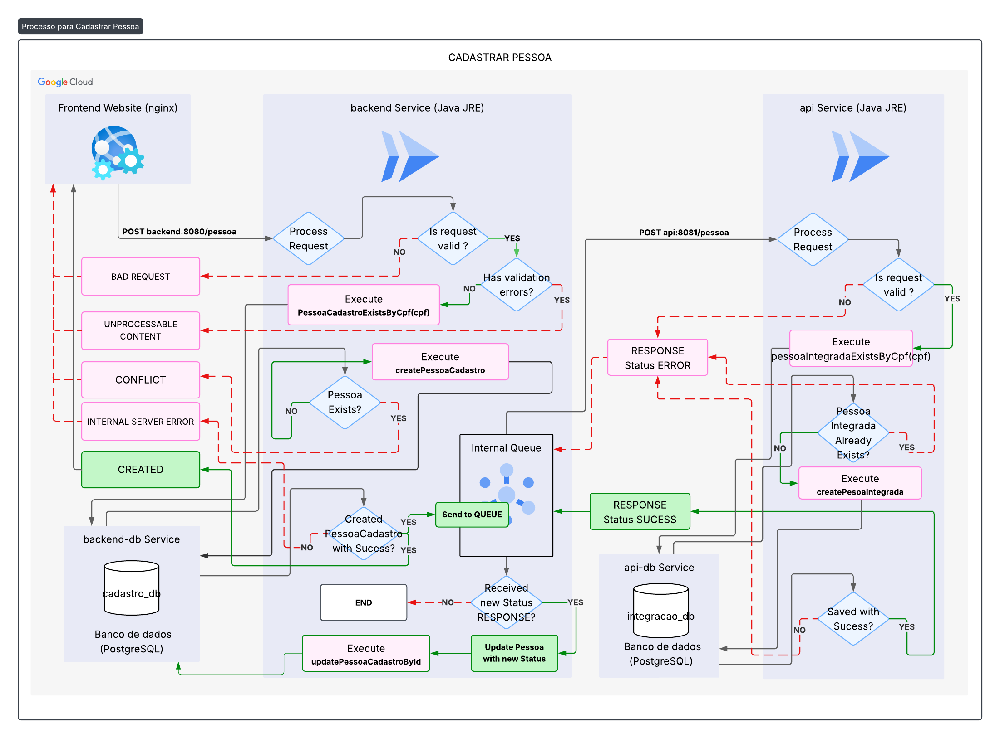
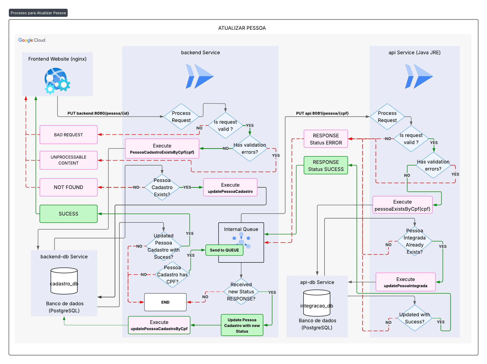
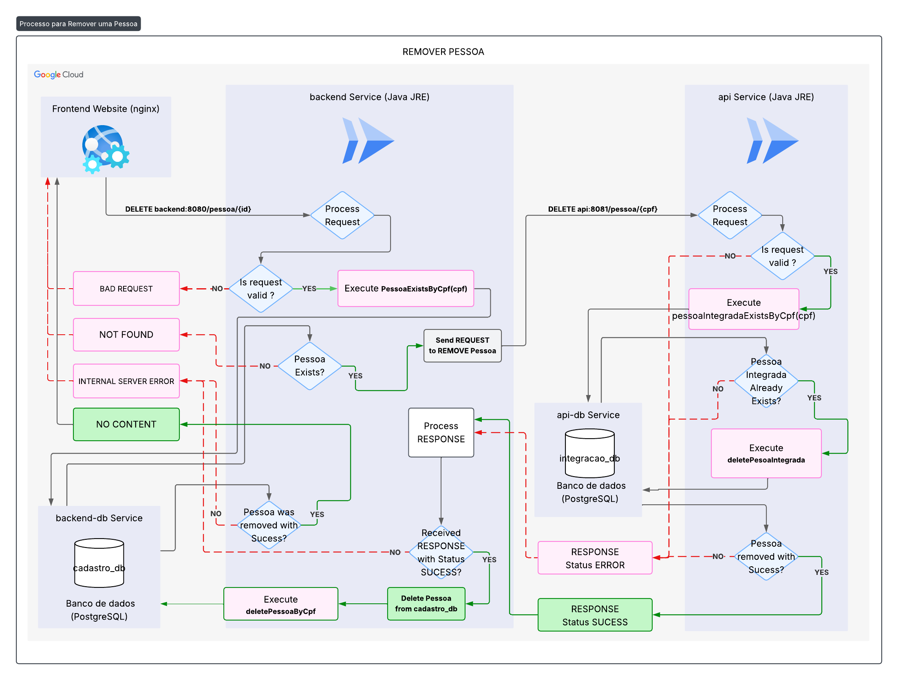
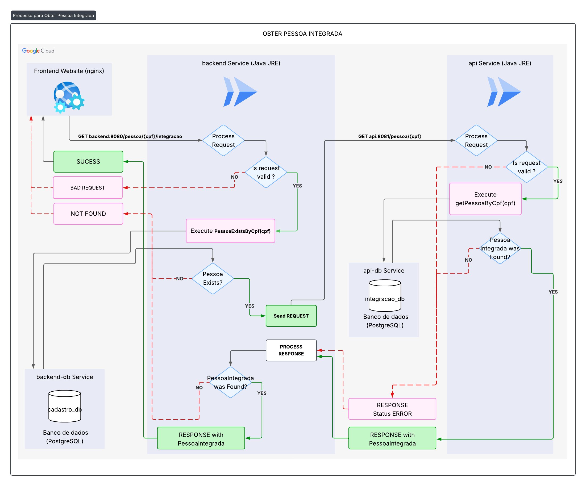
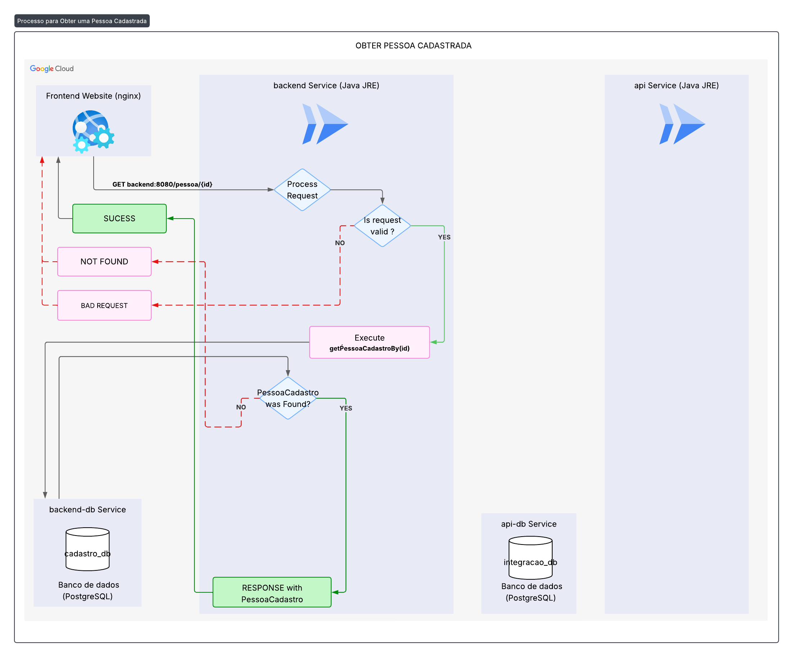

# gerenciador-de-pessoas
Projeto demonstração de uma solução de gerenciamento de pessoas (Pessoas Cadastradas e Pessoas Integradas).
- Backend: aplicação desenvolvida com Java 21 e Spring Boot que disponibiliza uma api para gerenciar Pessoas, se integra com a aplicação Api e se comunica com o banco de dados cadastro_db. 
- Api : aplicação backend desenvolvida com Java 21 e Spring Boot recebe requisições da aplicação Backend para gerenciar Pessoas Integradas e se comunica com o banco de dados integracao_db.
- Frontend: aplicação desenvolvida com React e JavaScript.
Uma Pessoa Cadastrada é a Pessoa com cadastro salvo no banco de dados de cadastro e possui ao menos o nome atendendo às regras de validação.
Já a pessoa Integrada é a Pessoa que foi Cadastrada e possui suas informações validadas e preenchidas contendo, além do seu Nome, Data de Nascimento, Email, CPF e Endereço completo.

## Sumário
* [1. Aplicações](#aplicações)
* [1.1 Backend](#backend)
* [1.1.1 - Funcionamento ](#funcionamento)
* [1.1.2 - Fila interna ](#fila-interna-jms)
* [1.2 Api](#api)
* [1.2.1 - Funcionamento ](#funcionamento-1)
* [1.3 Frontend](#frontend)
* [2. Diagramas de Processos](#diagramas-de-processos)
* [3. Bancos de dados](#bancos-de-dados)
* [4. Endpoints](#endpoints)
* [5. Regras de validação](#regras-de-validação)

## Aplicações

### Backend
Aplicação para gerenciar Pessoas através de API.

Tecnologias:
- Java + Spring Boot
- Spring Data JPA
- Hibernate:
- Lombok : Reduzir código boilerplate.
- Actuator : observabilidade e métricas com Docker e prometheus.
- SLF4J : Registros de log.
- JMS Server + Active MQ Artemis: Sistema de fila interna.

#### Funcionamento
Processa requsiições do frontend, se comunica com o cadastro_db (banco de dados PostgreSQL), possui uma fila interna (JMS) para se comunicar com a api de integração.

#### Fila interna JMS
Ao cadastrar ou atualizar uma Pessoa, a pessoa recebe Status de Integração Pendente, se todas as as informações dela estiverem preenchidas, será enviada para a fila. A fila vai enviar a pessoa para a api de integração (Api) e receberá como resposta o novo status de integração `SUCESSO` ou `ERRO`.

### API
Aplicação desenvolvida com Java e Spring Boot para gerenciar Pessoas Integradas através de API Rest e validar CEP em uma api externa. Se comunica com o banco de dados integracao_db.

Tecnologias:
- Java + Spring Boot
- Spring Data JPA
- Hibernate:
- Lombok : Reduzir código boilerplate.
- SLFJ: Registro de log.
- Actuator : observabilidade e métricas com Docker e prometheus.

#### Funcionamento
Processa requsiições da aplicação backend, se comunica com o cadastro_db (banco de dados PostgreSQL), possui uma fila interna (JMS) para se comunicar com a api de integração.

#### Integração
A integração recebe a Pessoa Cadastrada da requisição vinda da aplicação backend, se ela possuir todas as informações preenchidas e atendendar a todos os critérios das [Regras de validação](#regras-de-validação), salva a Pessoa Integrada no banco de dados `integracao_db` e retorna mensagem SUCESSO. Caso ocorra alguma falha retorna `ERRO`. 

### Frontend
O frontend é a interface visual para gerir Pessoas através de uma aplicação web, se comunica com outros sistemas através de protocolo HTTP e foi  desenvolvida com JavaScript e framework React. Apresenta um formulário de Cadastro de Pessoa, caixa de busca para Busca de Pessoa Integrada e Listagem de Pessoa com ações individuais(editar, excluir e integrar).

// TODO: Adicionar interface

#### Cadastro de Pessoa
É um formulário para Cadastro de Pessoa, requer o nome obrigatoriamente e exige que os campos preenchidos atendam às [Regras de Validação](#regras-de-validação).
Ao preencher o CEP, será realizada a validação do CEP em API externa, caso o CEP não possa ser encontrado, o cep será definido como 00000000 e os outros campos do Endereço serão obrigatórios.
Se o CPF estiver preenchido e já existe uma Pessoa Cadastrada com o CPF informado, não será possível fazer um novo cadastro.

#### Busca de Pessoa Integrada
É uma seção dedicada à pesquisa de uma pessoa integrada pelo cpf, vai exibir, além dos dados de inseridos no formulário Cadastro pessoa, a data de integração e a data da última atualização.

#### Listagem de Pessoa
- A tabela deve listar todas as pessoas cadastradas no banco de dados.
- Coluna nascimento dd/mm/AAAA
- Coluna CPF 000.000.000-00
- Coluna Cidade : Cidade / Estado
- Coluna Situação da Integração : Não enviado / Pendente / Sucesso / Erro
- Botão Editar para carregar os dados da pessoa no formulário.
- Botão de Remover para remover os dados da pessoa localmente e excluir a pessoa remotamente.
- Botão de Integrar para captar o ID da Pessoa Cadastrada, verificar todos os dados preenchidos e enviar para ser atualizada remotamente, garantindo a integração.

####

## Diagramas de Processos
#### Cadastrar Pessoa


#### Atualizar Pessoa


#### Remover Pessoa


#### Obter Pessoa Integrada


### Obter Pessoa Cadastrada


## Bancos de dados

### Esquema do banco de dados `cadastro_db`
| Coluna             | Tipo     | Restrições/Notas                          |
| :----------------- | :------- | :---------------------------------------- |
| **Pessoa** |          |                                           |
| `idPessoa`         | Integer  | **PK** (Chave Primária)                   |
| `nome`             | String   | Nome completo da pessoa                   |
| `nascimento`       | Date     | Data de nascimento da pessoa              |
| `cpf`              | String   | CPF da pessoa (considerar unicidade)      |
| `email`            | String   | Endereço de e-mail da pessoa              |
| `endereco`         | Endereco | Referência ao objeto de endereço associado |
| `situacaoIntegracao` | String   | Status de integração da pessoa            |
| **Endereco** |          |                                           |
| `idPessoa`         | Integer  | **FPK** (Chave Primária e Estrangeira)    |
| `cep`              | Integer  | CEP do endereço                           |
| `rua`              | String   | Nome da rua                               |
| `numero`           | Integer  | Número do imóvel                          |
| `cidade`           | String   | Nome da cidade                            |
| `estado`           | String   | Sigla do estado                           |


### Esquema do Banco de dados `integracao_db`
| Coluna               | Tipo     | Restrições/Notas                          |
| :------------------- | :------- | :---------------------------------------- |
| **Pessoa** |          |                                           |
| `idPessoa`           | Integer  | **PK** (Chave Primária)                   |
| `criacaoRegistro`    | Date     | Data e hora de criação do registro        |
| `alteracaoRegistro`  | Date     | Última data e hora de alteração do registro |
| `nome`               | String   | Nome completo da pessoa                   |
| `nascimento`         | Date     | Data de nascimento da pessoa              |
| `cpf`                | String   | CPF da pessoa                             |
| `email`              | String   | Endereço de e-mail da pessoa              |
| `endereco`           | Endereco | Referência ao objeto de endereço associado |
| **Endereco** |          |                                           |
| `idPessoa`           | Integer  | **FPK** (Chave Primária e Estrangeira)    |
| `cep`                | Integer  | CEP do endereço                           |
| `rua`                | String   | Nome da rua                               |
| `numero`             | Integer  | Número do imóvel                          |
| `cidade`             | String   | Nome da cidade                            |
| `estado`             | String   | Sigla do estado                           |


## Endpoints
### Endpoints da aplicação backend
#### Salvar pessoa 

**URL:** `/pessoa`  
**Método HTTP:** `POST`  
**Descrição:** Salvar uma nova pessoa.

**Modelo de Reequisição(`application/json`):**  

```JSON
{
    "nome": "String",
    "dataNascimento": "String",
    "cpf": "String",
    "email": "String",
    "endereco": {
        "cep": "Integer",
        "rua": "String",
        "numero": "Integer",
        "cidade": "String",
        "estado": "String"
 }
}
```

**Exemplo de resposta:(Sucesso - `201 Created`):**

```JSON
{
    "nome": "String",
    "dataNascimento": "String",
    "cpf": "String",
    "email": "String",
    "endereco": {
        "cep": "Integer",
        "rua": "String",
        "numero": "Integer",
        "cidade": "String",
        "estado": "String"
 }
}
```

**Exemplo de resposta:(Erro - `400 Bad Request`):**


#### Atualizar pessoa pelo id
**URL**: `/pessoa/{id}`    
**Método HTTP:** `PUT`  
**Descrição:** Atualizar informações de uma pessoa pelo seu ID.

**Parâmetros de Path**  
**`id`** (Integer) - O ID único da Pessoa a ser atualizada (Obrigatório).

**Corpo de requisição (`application/json`):**
```JSON
{
    "nome": "String",
    "dataNascimento": "String",
    "cpf": "String",
    "email": "String",
    "endereco": {
        "cep": "Integer",
        "rua": "String",
        "numero": "Integer",
        "cidade": "String",
        "estado": "String"
 }
}
```

**Exemplo de resposta:(Sucesso - `200 OK`):**
```JSON
{
    "nome": "String",
    "dataNascimento": "String",
    "cpf": "String",
    "email": "String",
    "endereco": {
        "cep": "Integer",
        "rua": "String",
        "numero": "Integer",
        "cidade": "String",
        "estado": "String"
    }
}
```

#### Obter pessoa pelo ID

```http
  GET /pessoa/{id}
```

| Parâmetro   | Tipo       | Descrição                                   |
| :---------- | :--------- | :------------------------------------------ |
| `id` | `integer` | **Obrigatório** O ID único da Pessoa a ser obtida  |


**Exemplo de resposta:(Sucesso - `200 OK`):**
```JSON
{
    "nome": "String",
    "dataNascimento": "String",
    "cpf": "String",
    "email": "String",
    "endereco": {
        "cep": "Integer",
        "rua": "String",
        "numero": "Integer",
        "cidade": "String",
        "estado": "String"
    }
}

```

#### Obter Pessoa Integrada pelo CPF

```http
  GET /pessoa/{cpf}/integracao
```

| Parâmetro   | Tipo       | Descrição                                   |
| :---------- | :--------- | :------------------------------------------ |
| `cpf` | `integer` | **Obrigatório** O cpf (valor númerico único) da Pessoa Integrada a ser obtida  |


**Exemplo de resposta:(Sucesso - `200 OK`):**
```JSON
{
    "nome": "String",
    "dataNascimento": "String",
    "cpf": "String",
    "email": "String",
    "endereco": {
        "cep": "Integer",
        "rua": "String",
        "numero": "Integer",
        "cidade": "String",
        "estado": "String"
    }
}

```

#### Remover Pessoa pelo ID

```http
  DELETE /pessoa/{id}
```

| Parâmetro   | Tipo       | Descrição                                   |
| :---------- | :--------- | :------------------------------------------ |
| `id` | `integer` | **Obrigatório** O ID único da Pessoa a ser obtida  |

**Exemplo de resposta:(Sucesso - `204 No Content`):**
```JSON
```

#### Obter lista de Pessoas Cadastradas
```http
  GET /pessoa
```

| Parâmetro   | Tipo       | Descrição                                   |
| :---------- | :--------- | :------------------------------------------ |
| `page` | `integer` | **Não obrigatório** O número da página da lista de Pessoas Cadastradas a ser obtida. Padrão(1)  |
| `size` | `integer` | **Não obrigatório** A quantidade de pessoas a ser obtida por página. Padrão(50)  |


**Exemplo de resposta: (Sucesso - `200 OK`):**
```JSON
[{
    "nome": "String",
    "dataNascimento": "String",
    "cpf": "String",
    "email": "String",
    "endereco": {
        "cep": "Integer",
        "rua": "String",
        "numero": "Integer",
        "cidade": "String",
        "estado": "String"
    }
},{
    "nome": "String",
    "dataNascimento": "String",
    "cpf": "String",
    "email": "String",
    "endereco": {
        "cep": "Integer",
        "rua": "String",
        "numero": "Integer",
        "cidade": "String",
        "estado": "String"
    }
},{
    "nome": "String",
    "dataNascimento": "String",
    "cpf": "String",
    "email": "String",
    "endereco": {
        "cep": "Integer",
        "rua": "String",
        "numero": "Integer",
        "cidade": "String",
        "estado": "String"
    }
}
]

```

### Endpoints da aplicação Api

#### Obter Pessoa Integrada

```http
  GET localhost:8081/pessoa/{cpf}
```

| Parâmetro   | Tipo       | Descrição                           |
| :---------- | :--------- | :---------------------------------- |
| `cpf` | `Integer` | **Obrigatório**. O número do CPF da Pessoa 

**Exemplo de resposta (Sucesso - `200 OK`):**
```JSON
{
    "nome": "String",
    "dataNascimento": "String",
    "cpf": "String",
    "email": "String",
    "endereco": {
        "cep": "Integer",
        "rua": "String",
        "numero": "Integer",
        "cidade": "String",
        "estado": "String"
    },
    "dataHoraInclusaoRegistro" : "Timestamp",
    "dataHoraUltimaAlteracaoRegistro" : "Timestamp"
}
```

**Exemplo de resposta (Not Found - `404 Not Found`):**
```JSON
```


**Exemplo de resposta:(Erro - `400 Bad Request`):**

```JSON
```

#### Salvar Pessoa Integrada

```http
  POST localhost:8081/pessoa
```

| Campo   | Tipo       | Descrição                           |
| :---------- | :--------- | :---------------------------------- |
| `nome` | `String` | **Obrigatório**. O valor da transação.
| `dataNascimento` | `String` | **Obrigatório**. A data de nascimento com formato dd/mm/AAAA. Exexemplo: 25/12/1999 
| `cpf` | `String` | **Obrigatório**. O número único do CPF da pessoa 
| `email` | `String` | **Obrigatório**. O email da pessoa 
| `endereco` | `Object` | **Obrigatório**. Objeto contendo o endereço completo da pessoa 
| `cep` | `Integer` | **Obrigatório**. O número do cep da pessoa 
| `rua` | `String` | **Obrigatório**. O nome da rua/logradouro 
| `numero` | `Integer` | **Obrigatório**. O número da residência.
| `cidade` | `String` | **Obrigatório**. O nome da cidade da Pessoa. 
| `estado` | `String` | **Obrigatório**. O nome do estado da Pessoa. 


**Exemplo de requisição:**

```JSON

{
    "nome": "String",
    "dataNascimento": "String",
    "cpf": "String",
    "email": "String",
    "endereco": {
        "cep": "Integer",
        "rua": "String",
        "numero": "Integer",
        "cidade": "String",
        "estado": "String"
 }
}
```

**Exemplo de resposta (Sucesso - `200 OK`):**
```JSON
{   
    "idPessoa": 123,
    "mensagem":"Sucesso"   
}
```

**Exemplo de resposta:(Erro - `400 Bad Request`):**

```JSON
{
    "idPessoa": 123,
    "mensagem": "Erro"
}
```


**Exemplo de resposta:(Erro - `422 Unprocessable Content`):**

```JSON
{
    "idPessoa": 123,
    "mensagem": "Erro"
}
```

#### Atualizar Pessoa Integrada

```http
  PUT localhost:8081/pessoa/{cpf}
```

| Parâmetro   | Tipo       | Descrição                           |
| :---------- | :--------- | :---------------------------------- |
| `cpf` | `Integer` | **Obrigatório**. O número do CPF da Pessoa 

**Exemplo de resposta:(Sucesso - `200 OK`):**

```JSON
{
    "idPessoa": "Integer",
    "mensagem": "Sucesso"
}
```

**Exemplo de resposta:(Erro - `400 Bad Request`):**

```JSON
{
    "idPessoa": "Integer",
    "mensagem": "Erro"
}

**Exemplo de resposta:(Erro - `422 Unprocessable Content`):**

```JSON
{
    "idPessoa": "Integer",
    "mensagem": "Erro"
}
```

#### Remover Pessoa Integrada

```http
  DELETE localhost:8081/pessoa/{cpf}
```

| Parâmetro de Path   | Tipo       | Descrição                           |
| :---------- | :--------- | :---------------------------------- |
| `cpf` | `Integer` | **Obrigatório**. O número do CPF da Pessoa 


**Exemplo de resposta (Sucesso - `200 OK`):**
```JSON
{   
    "mensagem":"String"   
}
```

## Regras de validação
- Validação do Nome : O nome precisa ter mais de 1 palavra e cada palavra precisa ter a primeira letra maiúscula.
- Data de Nascimento : deve ter o formato dia/mês/ano. Exemplo: 25/12/1999
- Email: deve atender ao formato de email. Exemplo: meu-email@gmail.com
- CPF: deve ser único e ser composto de exatamente 11 dígitos e possui máscara 000.000.000-00. 
- Endereço: O endereço completo é composto por CEP(número inteiro com máscara 00000-000), Rua(nome do logradouro), Número(número da residência), Cidade e Estado.
- Informações requeridas para Pessoa Cadastro: O nome é a única informação obrigatória. Caso o CEP seja inserido e ocorra uma falha ao obter o CEP, o campo CEP será definido como 00000-000 e passarão a ser obrigatórios os campos rua, número, cidade e estado.
- Informações requeridas para Pessoa Integrada: Todas as informações são obrigatórias e o CEP precisa ser verificado como válido em API externa.